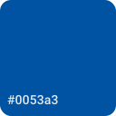
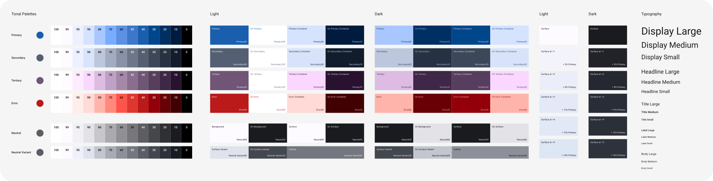

# GrapheneOS Branding

Generally based on [Material Design 3](https://m3.material.io/).

## Color

Source Color: #0053a3

## Theme

Exception typography:
The Bold variant is preferred over the Regular variant for headings.

## Font

Roboto where possible.
Noto as fallback.
